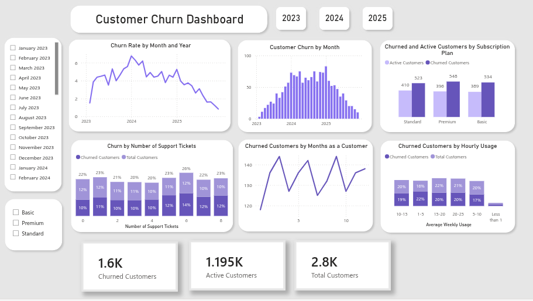

# **Project 1: Customer Churn using Excel and Power Bi**

***Excel and PowerBi Project***

## Business Problem
A business with a subscription-based service wants to see their customer churn from the last three years and understand the potential causes of customer loss.
Within the data, I want to explore:
* How many customers have churned across the total 3 year period?
* How many customers have churned per month?
* How does weekly usage affect churn rate?
* How does the number of support tickets impact churn rate?
* How does the churn rate change across subscription type?
* How does duration as a customer impact churn rate, and when does churn typically happen?

## Key Insights 
Since June 2025, Customer Churn has been consistently falling, with the 
churn rate in 2025 falling from 5.27% to 0.84%. As of December 2025, 
churn is at the lowest rate across the 3 year period. 

## Excel 
***Data Cleaning and Formatting***

I started by analysing the information within excel, checking for blanks, formatting issues and errors. 
* Duplicated the spreadsheet to keep a separate version of the raw data 
* Checked for duplicates and ensured users haven’t been added more than once
* Arranged column width
* Added a filter to each column and checked for typing errors, spelling issues, duplicated category names, inconsistent dates and        ensured each column contained relevant information
* Checked that all columns had correct formatting for dates, currency, text etc
* Renamed columns of clarity 
* I decided to change the 'Yes' and 'No' from the 'Customer Churn' column into 'Active' and 'Inactive' as this makes it easier to        understand when later visualising. ‘Yes’ or ‘No’ could be ambiguous and confusing when presented in a graph.

***Data Exploration***
* The salary row is originally formatted to show '699,' however I want this to be a currency, formatted as 6.99. I created a new         column and divided cell contents by 100. In the new column, =D2/100 and then Ctrl D to copy the formula down. I then changed format    to currency.
* To emphasise customer churn, I added conditional formatting. This clearly highlights whether the customer is still active or has       churned. 
* From the ‘Subscription Start Date,’ I created a ‘Subscription Start Month/Year’ column. The mmm-yyyy format, and collating data by     month, means that churn by month can be analysed and allows for easier visualisation later, as opposed to a dd/mm/yyyy format which    would create a large amount of data. 
* I decided to categorise "Days Since Last Login," into ranges for clarity. I added a new column with the formula, =IFS(M2>=50,"50-60    Days", M2>=40,"40-50 Days", M2>=30, "30-40 Days", M2>=20, "20-30 Days", M2>=10, "10-20 Days", M2>=1, "1-10 Days")
* To later visualise data relating to customer usage hours by customer churn, I categorised the average weekly usage column into         ranges using an IFS formula =IFS(G2>=20,"20-25", G2>=15,"15-20", G2>=10,"10-15", G2>=5,"5-10", G2>=1,"1-5", G2<1,"Less than 1")
* I applied conditional formatting to the "Number of Support Tickets" columns, highlighting the customers with a high number of          support tickets.
* To see churn by month, I created a customer exit month column. I used an IF formula alongside EDATE to add months from the 'Months     as a Customer' column to their start date if 'Churned.' I kept the current customers blank to avoid text and dates in the same         column =IF(B2="Inactive", EDATE(D2,K2), "")

## Power Bi
To visualise the data collected, I created a dashboard within PowerBi.
* Within Power Bi, I have a calendar table covering the three years of data. The calendar links to active and churned customers, and per month, will show the number of customers active within the month and the number of customers who have churned at any time in that month. 
* I created three slicers: Month/Year, Subscription Plan, and Year only. The Month/Year slicer allows graph data to be visualised for a single month. Subscription Plan allows data in the graphs to be adjusted per subscription type. The Year slicer allows the user to see data per individual year. 
* Churn Rate: The percentage of churn rate per month is displayed in a line graph to show trend over time. This could be filtered by slicer to show individual years. 
* Customer Churn by Month: The data for total churn by month is displayed in a column graph in order to see individual months clearly and see comparison. 
* Churned and Active Customers by Subscription Plan: For this data, I used a column graph with an individual column for active and churned customers for each plan type. I have clear data labels on this graph and the side by side columns visualise comparison between active and churned numbers. 
* Churned Customers by Number of Support Tickets: Within excel, the data showed some customers with as high as 8 support tickets. As this is something that could potentially affect whether a customer could churn, I represented this in a visual. I created a column graph to clearly show the numbers per number of tickets. 
* Churn Customers per Months as a Customer: To show how the number of churned customers changes throughout customer duration and when churn is most likely to happen, I created a line graph. This shows trend over time and comparison of months.
* Churned Customers by Weekly Usage: In excel, I grouped the average hours into ranges for easier visualisation. I presented the data in a bar graph to show the comparison between ranges and present the effect of usage on whether a customer will churn
* I also have three cards: Active Customers, Churned Customers, Total Customers. These cards show the number of customers and both the active and churned cards change to when using the slicers. 

## Data Insights 

***Churn Rate by Month***
* Across the overall data range, the churn rate has been falling consistently since June 2025. The highest churn was between February 2023 and March 2023.
* In 2023, churn increased overall from 1.52% to 5.59% which large amount of fluctuation between months
* In 2024, churn decreased but still finished with a relatively high 4.4% (down from 6.77%)
* In 2025, churn also decreased from 5.27% to 0.84%. All subscription plans show an overall decrease in 2025 but the Basic Plan is the only subscription type with a slight increase from November to December (still an decrease overall.)
* The data suggests that the churn rate is falling based on latest figures

***Customer Churn by Month***
* From February 2023 to January 2024, aside from one month, churn increases month on month
* In January 2024, churn is 75 and in January 2025 84 customers leave. Churn is high in these two months and there is lots of fluctuation in the months between
* April 2025 to December 2025 is an almost consistent fall in churn

***Active and Churned Customers by Subscription Plan***
* Across the data range, Premium has the highest total customers but also the highest churn. Standard has the highest number of active customers and lowest churn across the three years
* Premium has the lowest churn in 2025 but numbers are very similar across the three plans. 

***Churned Customers by Number of Support Tickets***
* When looking at the data as a whole, and the years 2023 and 2024 individually, customer churn happens most frequently in customers with 6 support tickets. 
* In the overall data, high numbers of customers churn with 6-8 tickets, yet in 2025 alone, churn actually decreases after 6 tickets. 
* By subscription plan, the Premium plan has the highest total tickets and the highest number of customers with 8 tickets. Premium also has the most customers with 6,7 and 8 tickets combined. This could explain why Premium has a higher churn rate.

***Churned Customers by Months as a Customer***
* Overall, churn happens the most in months 3, 6 and 9
* In 2023, it happened most in month 2 but gradually dropped after month 6. Month 2 is highest for Basic and Premium but Month 3 is highest for Standard.
* In 2024, occurred most in months 3,6,9. Basic is highest in month 6, Premium in month 3 and Standard in month 9.
* In 2025, churn happened most in month 12 and the data shows an almost-consistent upward trend throughout the year. Looking at plan type, Premium is highest in month 12 but Basic and Standard are actually highest in month 11
* Across the 3 years, most Basic customers are lost in month 6, Premium in month 3 and Standard in month 9. 

***Churned Customers by Average Weekly Usage***
* Across the 3 years, customers with a weekly usage of 1-5 hours churn the most but those with 20-25 hours (the highest quantity represented) churn second most.
* In 2023, most customer churn is at 15-20 hours of usage. 
* In 2024, churn is highest in customers using the service between 1-5 hours
* In 2025, customers using the service between 20-25 hours per week on average have the highest churn
* Plan type by individual year shows a similar lack of pattern. The basic plan does show 1-5 hours with highest churn in 2023 and 2024, and 10-15 hours in 2025, suggesting churn in the basic plan happens most with customers using the service for a small amount of time per week. In both, Standard and Premium 1-5 hours is the highest or second highest in almost all years.

## Conclusion

The data shows that the churn rate increased in 2023 but fell in 2024 and 2025, with December 2025 having the lowest number of churned customers. The Premium plan has the highest number of customers in total but it also has the highest churn, whilst Standard has the highest number of active customers at present and the lowest churn overall. The data also suggests that more customers churn with 5+ support tickets and Premium has the most support tickets overall. Churn happened the most in months 3, 6 and 9 but, in 2025, it occurred the most in month 12. I would assume that, potentially, in years 2023 and 2024, the subscription length was 3, 6 or 9 months and perhaps this changed in 2025. Alternatively, there might have been a discount on 12 month plans. Across the 3 years, customers with a weekly usage of 1-5 hours churn the most but those with 20-25 hours churn second most.

[Customer Subsciptions CSV.xlsx](https://github.com/user-attachments/files/25454113/Customer.Subsciptions.CSV.xlsx)

